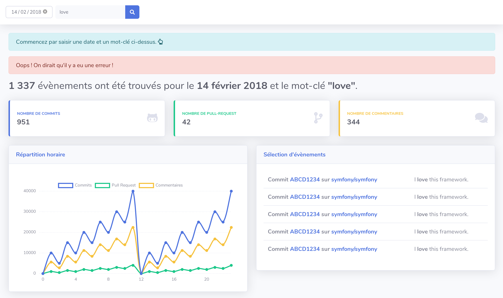

# Challenge GH Archive Keyword

>  tl;dr :  l'objectif de ce challenge est de développer avec [GH Archive](https://www.gharchive.org/) un petit dashboard en PHP sur la présence d'un mot-clé parmi les messages de commit d'un jour donné, par exemple une courbe du nombre de commits dans la journée du 14/02/2018 qui ont le mot-clé "love".

### Exemple de résultat

## Temps de réalisation :alarm_clock:

Ce challenge a été pensé pour être réalisé dans **un délai court**, c'est à vous d'y accorder le temps que vous jugez nécessaire.

Vous pouvez passer plus de temps pour le compléter de manière facultative. Il n'est pas nécessaire de terminer complètement le challenge pour envoyer votre participation, l'essentiel est d'avoir assez de matière pour en discuter ensuite.

Vous devrez rendre le livrable au maximum **dans un délai de 7 jours**.

## Évaluation :trophy: 

Le code sera évalué sur les critères suivants *(laissés à votre libre interprétation)* :

* Respect des consignes
* Créativité
* Rigueur
* Qualité des features délivrées

On priorisera avant tout la qualité des features délivrées à la quantité : on préferera voir une seule feature de très bonne qualité à une dizaine de features faites à la va-vite.

## Objectifs :rocket:

[GH Archive](https://www.gharchive.org/) est un site qui permet de retrouver l'historique des évènements publiques qui ont été réalisés sur GitHub pendant une période donnée.

L'objectif premier de ce challenge est de récupérer une partie des données utiles de certains évènements pour les stocker dans une base de données. Cette partie sera réalisée par un script lancé en ligne de commandes.

Il s'agira ensuite de créer une interface web permettant d'aller requêter les informations de cette base de données, en renseignant une date et un mot-clé via un formulaire. Le résultat affiché sera un graphique du nombre d'évènements qui contiennent ce mot-clé (par exemple : dans le message d'un commit, ou dans un commentaire sur une pull-request) et un tableau d'une sélection d'évènements.

Pour gagner du temps sur le code frontend, nous vous fournissons [un template](./template) issu du thème bootstrap 4 [SB Admin 2](https://startbootstrap.com/previews/sb-admin-2/).

**Nous vous encourageons à vous faire plaisir pendant ce challenge, n'hésitez pas par exemple à profiter de cette occasion pour tester une technologie qui vous intéresse !**

## Consignes :woman_teacher:

* Vous livrerez votre projet sur un dépôt GitHub (public ou privé, à votre convenance).
* Vous êtes libres d'utiliser toutes technologies, outils, base de données ou librairies pour réaliser le challenge. **La seule obligation est d'utiliser PHP (orienté objet) pour la plus grosse partie du code** de votre application.
* Vous devrez utiliser le [template fourni](./template) comme base de votre application web. Vous êtes libres de l'améliorer mais **l'objectif de ce challenge est principalement d'évaluer vos compétences backend**.
* Les données de [GH Archive](https://www.gharchive.org/) devront être stockées dans une base de données par un script d'import avant d'être requêtées par l'application.
* Vous écrirez votre code avec un objectif de qualité.

## Bonus :sparkles:

N'hésitez pas à nous en mettre plein les yeux ! Voici quelques pistes à creuser qui sont facultatives :

* Bonnes pratiques
* Coding standard
* Design Patterns
* Documentation
* Environnement de développement (Virtualisation, Docker, etc.)
* Industrialisation
* Intégration continue
* Outillage
* Performance
* Scalabilité
* Tests automatisés

# Bon courage ! :muscle:
